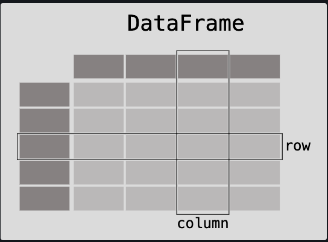

# Pandas

**Pandas** เป็นเครื่องมือที่ใช้งานง่ายสำหรับการวิเคราะห์ข้อมูลใน Python ซึ่งเหมาะสำหรับการทำงานกับข้อมูลตารางที่ต้องการการจัดการและการวิเคราะห์ที่มีความยืดหยุ่นสูง

**DataFrame** เป็นโครงสร้างข้อมูลสองมิติที่สามารถเก็บข้อมูลประเภทต่างๆ ในคอลัมน์ คล้ายกับ spreadsheet, table ใน sql



ตัวอย่างการสร้าง datafame โดยใช้ dict key ของ dict จะเป็นชื่อ column และ values ที่อยู่ใน list จะเป็นข้อมูลใน columns

```py linenums="1"
import pandas as pd

data = {
    'Name': ['Alice', 'Bob', 'Charlie', 'David', 'Eva'],
    'Age': [25, 30, 35, 40, 45],
    'City': ['New York', 'Los Angeles', 'Chicago', 'San Francisco', 'Houston'],
    'Salary': [50000, 60000, 70000, 75000, 67000],
    'Experience': [5, 7, 10, 12, 7],
}

df = pd.DataFrame(data)

print(df)

# แสดงข้อมูล type ของ colume
print(df.dtypes)

# แสดงข้อมูล dimensional ของ dataframe
print(df.shape)

# แสดงข้อมูลของ dataframe รวมทั้ง index dtypes และ memory usage.
print(df.info(verbose=True))

# การเลือกคอลัมน์
print(df['Name'])

# filter ข้อมูลที่อายุมากกว่า 30
print(df[df['Age'] > 30])

# คำนวณอายุเฉลี่ย
average_age = df['Age'].mean()
print(average_age)

# หาค่า max ของ salary
max_salary = df['Salary'].max()
print(max_salary)
```
